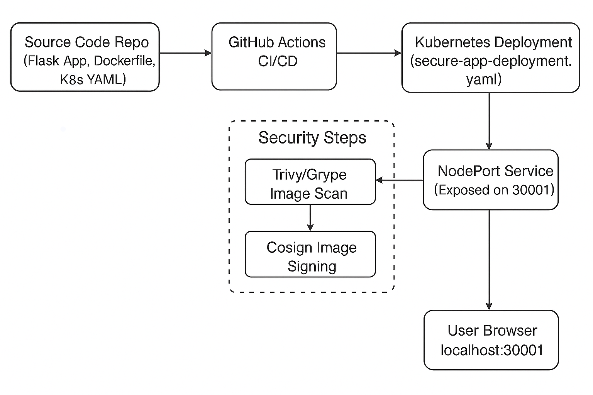

## Secure Container Pipeline: Automated Build, Scan, Sign & Deploy to Kubernetes.

Automate a secure CI/CD workflow for Python container apps! This project walks through building, scanning and signing a Docker image in GitHub Actions, pushing to Docker Hub and deploying to Kubernetes with best-practice security settings—including non-root enforcement, vulnerability scanning, image signing and liveness probes. Every major step is evidenced and explained for recruiters, reviewers and curious engineers.

---

## Table of Contents

- [Overview](#overview)
- [Real-World Risk](#real-world-risk)
- [What I Built](#what-i-built)
- [Diagram](#diagram)
- [Objectives](#objectives)
- [Steps Performed](#steps-performed)
  - [1. Project & Repo Initialization]
  - [2. Secure Docker Image Build & Push]
  - [3. GitHub Actions CI/CD: Build, Scan & Sign]
  - [4. Kubernetes Security-First Deployment]
  - [5. Adding Health Probes (Liveness/Readiness)]
  - [6. Exposing & Testing the App]
  - [7. Security Exception Documentation]
  - [8. Cleanup]
- [Screenshots](#screenshots)
- [Security Notes and Exceptions](#security-notes-and-exceptions)
- [Lessons Learned](#lessons-learned)
- [References](#references)
- [Contact](#contact)

---

## Overview

This portfolio lab demonstrates a secure CI/CD pipeline for building, scanning, signing and deploying a Python web app container, all the way to a hardened Kubernetes pod. The pipeline leverages best practices and open-source tools **(Trivy, Grype, Cosign)**, with all evidence and reasoning documented for recruiters and reviewers.

---

## Real-World Risk

Without secure automation and supply chain protection for containers:
  - Container images can inherit vulnerabilities from base images.
  - Manual pushes risk unsigned or tampered images reaching production.
  - Unscanned images may introduce CVEs into Kubernetes clusters.
  - Lack of automated policies makes enforcing non-root containers unreliable.
  - Publicly accessible services can be exposed without proper probes or RBAC.

---

## What I Built

A full end-to-end secure container deployment pipeline that:
  - Automates Docker image builds with security-focused Dockerfile best practices.
  - Scans images for vulnerabilities (Trivy/Grype) and signs them (Cosign) before deployment.
  - Uses GitHub Actions for continuous integration and supply chain security.
  - Enforces Kubernetes securityContext (runAsNonRoot, no privilege escalation).
  - Implements liveness/readiness probes for resilient, observable services.
  - Documents and justifies any inherited, unavoidable CVEs.
  - Cleans up all cloud and local resources post-deployment for a secure, auditable workflow.

---

## Diagram

---

## Objectives

- Automate build, scan, sign and deploy steps for containerized Python applications.
- Enforce security with non-root containers, locked dependencies, and Kubernetes securityContext.
- Integrate vulnerability scanning (Trivy, Grype) and fail CI on high/critical issues.
- Sign Docker images using Cosign for supply chain security.
  
---

## Steps Performed

### 1. Project & Repo Initialization
   - Created the project repository and set up local folder structure.
   - Added basic Flask app code and Dockerfile.
   - Verified structure and initial commit *(Screenshot: `repo_created.png` & `app_and_dockerfile.png`)*

### 2. Secure Docker Image Build & Push
   - Built the Docker image locally using a secure Dockerfile.
   - Pushed the image to Docker Hub for use in Kubernetes *(Screenshot: `image_pushed_signed.png`)*

### 3. GitHub Actions CI/CD: Build, Scan & Sign
   - Configured GitHub Actions to automate Docker image build, scan (Trivy/Grype) and signing (Cosign)
   - Secured secrets in GitHub repo settings *(Screenshots: `github_actions_run.png` & `github_secrets.png`)*

### 4. Kubernetes Security-First Deployment
   - Authored `secure-app-deployment.yaml` with:
     - Best-practice `securityContext` (runAsNonRoot, allowPrivilegeEscalation, etc.)
     - Non-root container user for defense in depth.
   - Applied the deployment and validated with `kubectl` *(Screenshot: `k8s-securitycontext-yaml.png`, `k8s-pod-running-nonroot.png` & `pod_running_as_nonroot.png`)*

### 5. Adding Health Probes (Liveness/Readiness)
   - Implemented livenessProbe in the deployment manifest.
   - Verified probe with `kubectl describe` *(Screenshot: `k8s-deployment-security-livenessprobe.png`, `kubectl-describe-pod-livenessProbe.png` & `describe-pod-readiness-liveness.png`)*

### 6. Exposing & Testing the App
   - Created a NodePort service to expose the app.
   - Used browser/curl to confirm external access *(Screenshot: `app-portforward-success.png` & `app_and_dockerfile.png`)*

### 7. Cleanup 
   - Deleted all Kubernetes resources after testing.
   - Removed test Docker images from local and remote.
   - Audited and pruned sensitive files before finalizing repo *(Screenshot: `pods-healthy-after-livenessprobe.png` & `readiness-probe-added.png`)*

---

## Screenshots

*All screenshots are included in the `screenshots/` folder.*

| Step | Filename                                  | Description                                            |
| ---- | ----------------------------------------- | ------------------------------------------------------ |
| 1    | repo_created.png                          | Initial repo and project structure                     |
| 1    | app_and_dockerfile.png                    | Python app and Dockerfile (security-hardened)          |
| 2    | image_pushed_signed.png                   | Docker image pushed and signed                         |
| 3    | github_actions_run.png                    | GitHub Actions pipeline run                            |
| 3    | github_secrets.png                        | GitHub Actions secrets for DockerHub/Cosign            |
| 4    | k8s-securitycontext-yaml.png              | Highlighting `securityContext` best practices          |
| 4    | k8s-pod-running-nonroot.png               | Pod running as non-root user                           |
| 5    | k8s-deployment-security-livenessprobe.png | Secure deployment YAML (livenessProbe/securityContext) |
| 5    | kubectl-describe-pod-livenessProbe.png    | Pod description with liveness/readiness info           |
| 6    | app-portforward-success.png               | App accessed via browser/curl on NodePort              |
| 7    | pods-healthy-after-livenessprobe.png      | All pods healthy after probe configuration             |
| 7    | readiness-probe-added.png                 | Readiness and liveness probes added to manifest        |

---

## Security Notes and Exceptions

**- Documented Vulnerabilities:** Some vulnerabilities (mainly in system libraries or base images) are unfixable, flagged as "won't fix" in Grype/Trivy reports and come directly from the official Python base image. 
**- Risk Understanding:** All app dependencies are locked and up to date. Risks are documented and mitigations noted in each step.
**- securityContext Section:** Kubernetes manifests use strict securityContext (non-root, no privilege escalation, read-only root filesystem)

---

## Lessons Learned

- CI/CD pipelines for containers must automate security—don’t rely on manual reviews!
- Image signing (Cosign) is now a must-have for modern supply chain security.
- Documenting and understanding unfixable vulnerabilities is important for real-world compliance.
- Container security is enforced at multiple layers: Dockerfile, image scanning and Kubernetes deployment.

---

## References

- [Kubernetes Official Documentation](https://kubernetes.io/docs/)
- [Docker Documentation](https://docs.docker.com/)
- [GitHub Actions Documentation](https://docs.github.com/en/actions)
- [Trivy: Vulnerability Scanner for Containers and Other Artifacts](https://aquasecurity.github.io/trivy/)
- [Grype: Vulnerability Scanner for Container Images & Filesystems](https://github.com/anchore/grype)
- [Cosign: Container Signing](https://github.com/sigstore/cosign)
- [OWASP Docker Security Cheat Sheet](https://cheatsheetseries.owasp.org/cheatsheets/Docker_Security_Cheat_Sheet.html)
- [Python Official Docker Images](https://hub.docker.com/_/python)
- [Best Practices for Writing Dockerfiles](https://docs.docker.com/develop/develop-images/dockerfile_best-practices/)
- [Kubernetes Security Context](https://kubernetes.io/docs/tasks/configure-pod-container/security-context/)

---

## Contact

Sebastian Silva C. – August, 2025 – Berlin, Germany  
- [LinkedIn](https://www.linkedin.com/in/sebastiansilc/)  
- [GitHub](https://github.com/SebaSilC)  
- [sebastian@playbookvisualarts.com](mailto:sebastian@playbookvisualarts.com)
